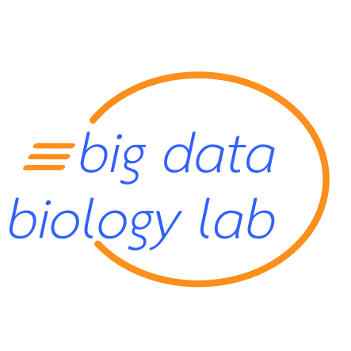

# Big Data Biology Lab at Fudan University

This is the lab of [Luis Pedro Coelho](http://luispedro.org) at Fudan
University in Shanghai housed in the [Institute of Science and Technology for
Brain-Inspired Intelligence](http://istbi.fudan.edu.cn) (starting mid-2018).

- [Interests](interests.html)
- [Open positions](positions.html)
